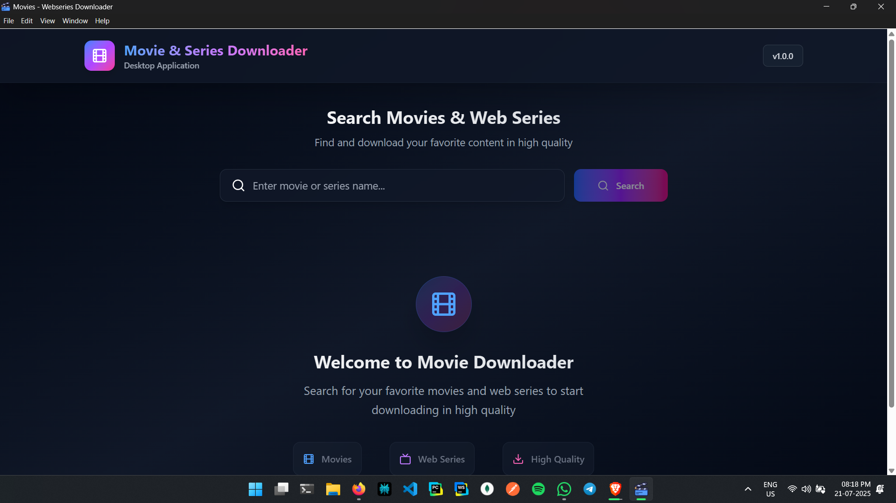

# Movies Downloader Electron

Movies Downloader Electron is an open-source desktop application built with [Electron](https://www.electronjs.org/) that allows users to search, download, and manage movies directly from their desktop. Designed for simplicity and efficiency, it provides a seamless experience for movie enthusiasts.

> **Important Note:**  
> Movies Downloader Electron requires [Brave Browser](https://brave.com/) to be installed on your system. The application uses Brave under the hood and will not run without it. Please ensure Brave is installed before launching the app.

## Features

- **Search Movies:** Find movies using integrated search functionality.
- **Download Manager:** Download movies with progress tracking and pause/resume support.
- **Library Management:** Organize downloaded movies in a local library.
- **User-Friendly Interface:** Modern and intuitive UI built with Electron.

## Installation

### Recommended: Download Pre-built Installer

- Visit the [Releases](https://github.com/monsurcodes/movies-downloader/releases) tab on GitHub.
- Download the latest `setup.exe` for Windows.
- Run the installer and follow the on-screen instructions.

### Advanced: Build from Source

#### Prerequisites

- [Node.js](https://nodejs.org/) (v14 or higher)
- [npm](https://www.npmjs.com/) or [yarn](https://yarnpkg.com/)

#### Steps

1. **Clone the repository:**
    ```bash
    git clone https://github.com/monsurcodes/movies-downloader.git
    cd movies-downloader
    ```

2. **Install dependencies:**
    ```bash
    npm install
    # or
    yarn install
    ```

3. **Build the application:**
    ```bash
    npm run make
    ```

4. **Find the installer:**
    - The generated installer will be available in the `out` directory.

## Usage

- Launch the app and use the search bar to find movies.
- Click on a movie to view details and download options.
- Manage your downloaded movies from the library section.

## Screenshots




## Contributing

Contributions are welcome! Please read the [CONTRIBUTING.md](CONTRIBUTING.md) for guidelines.

1. Fork the repository.
2. Create your feature branch (`git checkout -b feature/AmazingFeature`).
3. Commit your changes (`git commit -m 'Add some AmazingFeature'`).
4. Push to the branch (`git push origin feature/AmazingFeature`).
5. Open a Pull Request.

## License

This project is licensed under the [MIT License](LICENSE).

## Support

For issues and feature requests, please use the [GitHub Issues](https://github.com/monsurcodes/movies-downloader/issues) page.

## Acknowledgements

- [Electron](https://www.electronjs.org/)
- [Node.js](https://nodejs.org/)
- [HdHub4u](https://hdhub4u.family)
- All contributors

---

**Disclaimer:** This application is intended for educational purposes. Please respect copyright laws when downloading content.
